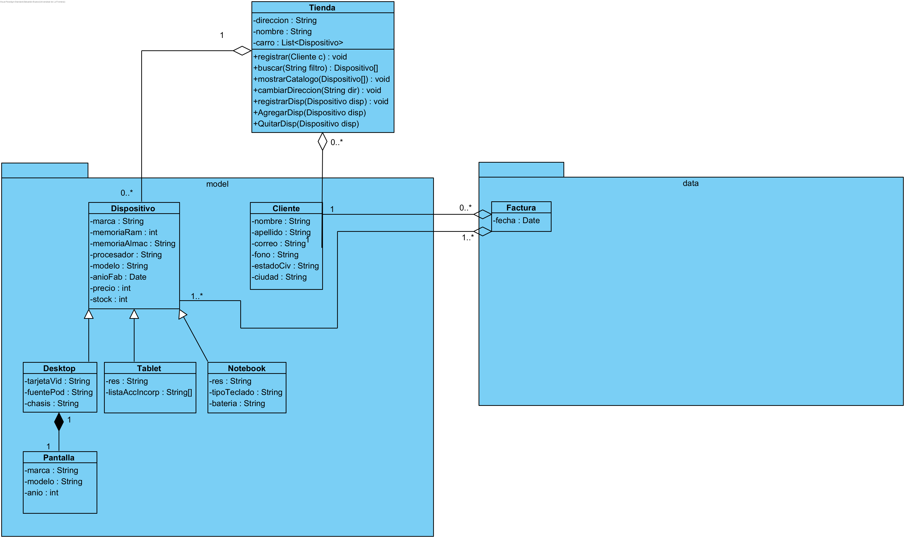
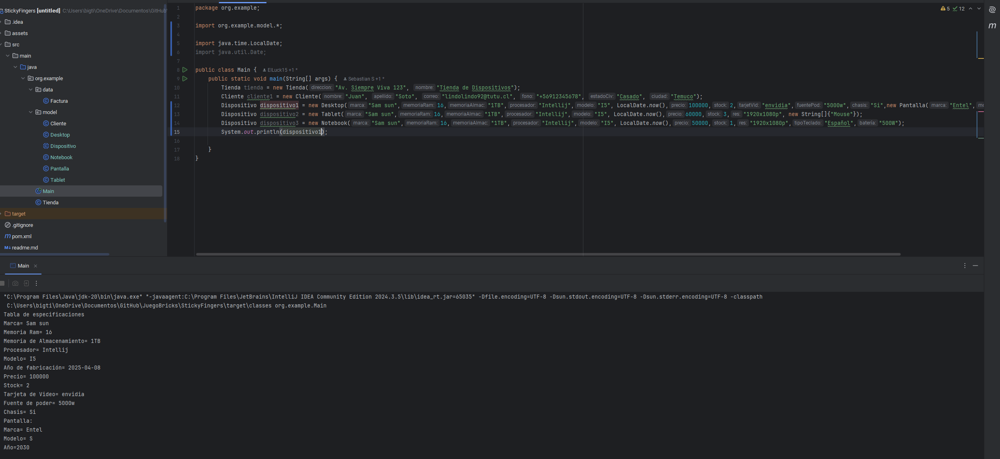

# Uso de POO + Diagrama de clases + Gestores de datos
### Integrantes
- Sebastián Bustos
- Sebastián Lück
- Eduardo Gómez
---
### Ánalisis de la problematica:
Las principales clases identificadas son Cliente, Desktop, Dispositivo, Notebook, Pantalla, Tablet, Factura y Tienda.
Tienda, siendo la clase que maneja las principales funciones de la aplicación como buscar, filtrar y entregar los dispositivos, también contiene una relación de agregacion con Clientes y Dispositivos.
Dispositivo es la clase padre de Notebook, Desktop y Tablet.
Desktop contiene un objeto Pantalla, cuya relación de composición, siendo que la pantalla no puede existir sin el Desktop.
Factura contiene un Cliente y una Tienda
### El diagrama de clases UML:

Como disclaimer, utilizamos el gestor de datos proporcionado por el ayudante por ende se sobre entiende que está aplicado a la tienda.
--
# Capturas del funcionamiento del programa

aquí irán las capturas del funcionamiento del programa